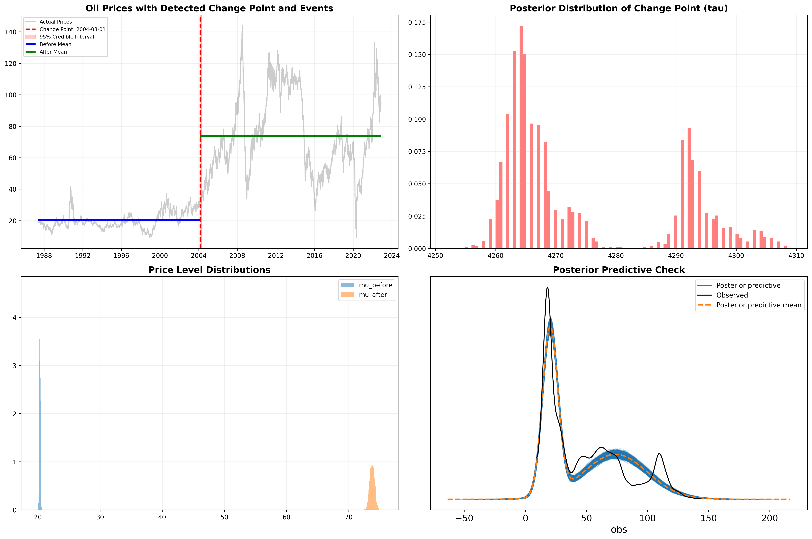
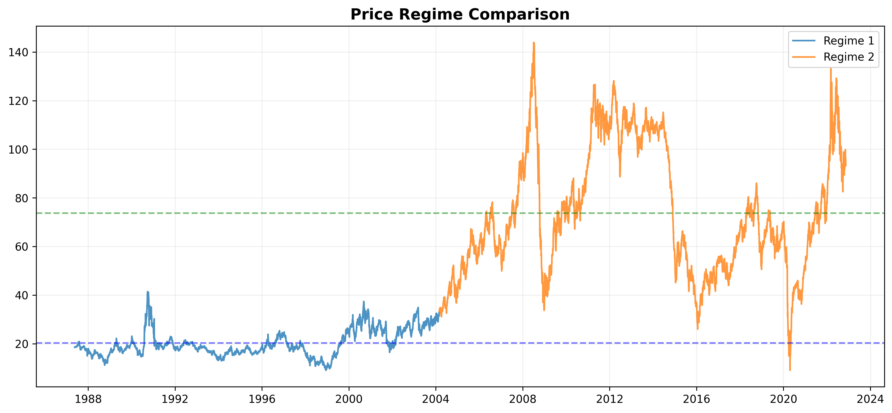
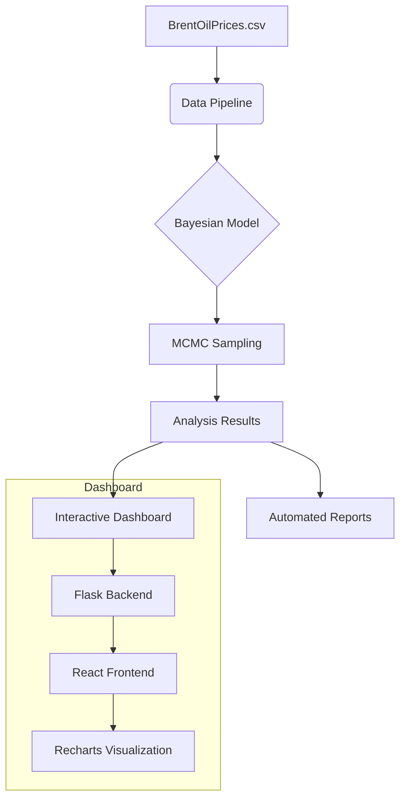

# Oil Price Change Point Detection & Analytics

A comprehensive Bayesian analysis system designed to detect structural breaks (regime shifts) in Brent Crude oil prices. This project combines advanced probabilistic modeling with a modern, interactive dashboard to help stakeholders correlate market volatility with global geopolitical and economic events.

---

## Key Features

*   **Bayesian Change Point Detection**: Leverages **PyMC** to identify the exact date and magnitude of regime shifts.
*   **Interactive Analytics Dashboard**: A full-stack application built with **Flask** and **React (Vite)** for real-time data exploration.
*   **Dynamic Visualizations**: High-fidelity charts using **Recharts** and **Matplotlib**, highlighting credible intervals and event correlations.
*   **MCMC Diagnostics**: Robust convergence checks including R-hat, ESS, and trace plots to ensure model reliability.
*   **Automated Insights**: Generates comprehensive markdown reports and statistical summaries of market transitions.

---

## Visual Highlights

### Change Point Analysis

*Figure 1: Detected regime shift with 95% Credible Interval and posterior distributions.*

### Regime Comparison

*Figure 2: Side-by-side comparison of price levels and volatility before and after the transition.*

---
## System Architecture



---

## Installation & Setup

### Prerequisites
- **Python 3.11+**
- **Node.js 18+**
- **pip** & **npm**

### Core Setup
1. Clone the repository:
   ```bash
   git clone https://github.com/zerubabelalpha/oil-price-changepoint.git
   cd oil_price_changepoint
   ```
2. Install Python dependencies:
   ```bash
   pip install -r requirements.txt
   ```

### Running the Analytics Pipeline
Generate the models and initial reports:
```bash
python scripts/run_pipeline.py
```

### Launching the Dashboard
Explore results interactively:

**1. Start Backend:**
```bash
cd dashboard/backend
pip install -r requirements.txt
python app.py
```

**2. Start Frontend:**
```bash
cd dashboard/frontend
npm install
npm run dev
```

---

##  Methodology

Our model uses a marginalized Bayesian approach to identify a single change point `τ` in a time series of `N` observations:

-   **Priors**: 
    -   `τ ~ DiscreteUniform(0, N-1)`
    -   `μ_before, μ_after ~ Normal(historical_mean, 20)`
    -   `σ_before, σ_after ~ HalfNormal(10)`
-   **Likelihood**: Transition from one Gaussian process to another at the point `τ`.
-   **Marginalization**: We marginalize over `tau` to enable efficient **NUTS** (No-U-Turn Sampler) sampling.

---

## Project Structure

| Directory | Description |
| :--- | :--- |
| `dashboard/` | Full-stack analytics application (Flask/React) |
| `src/` | Core Python library for modeling and EDA |
| `scripts/` | Pipeline execution and utility scripts |
| `notebooks/` | Interactive Jupyter research environment |
| `outputs/` | Generated visualizations, reports, and logs |
| `data/` | Raw and processed Brent oil price datasets |

---


